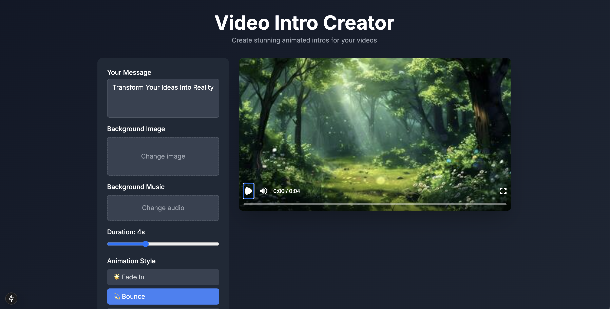

# Video Intro Creator with Next.js and Remotion

A powerful web application that allows you to create professional video intros with customizable text, animations, and effects. Built with Next.js and Remotion.



## Features

- 🎨 Real-time video preview
- 🎬 Multiple animation effects (Fade, Bounce, Spin)
- 🎨 Pre-defined color themes
- 🖼️ Custom background image upload
- 🎵 Background music support
- ⚡ Adjustable duration and font size
- 💾 Video download in MP4 format

## Prerequisites

Before you begin, ensure you have the following installed:

1. **Node.js** - Version 16.x or higher
   ```bash
   # Check your Node.js version
   node --version
   ```

2. **FFmpeg** - Required for video rendering
   ```bash
   # For macOS using Homebrew
   brew install ffmpeg

   # For Windows using Chocolatey
   choco install ffmpeg

   # For Ubuntu/Debian
   sudo apt-get install ffmpeg
   ```

3. **System Requirements**:
   - macOS, Windows, or Linux
   - Minimum 4GB RAM (8GB recommended)
   - Modern web browser (Chrome recommended)

## Installation

1. Clone the repository:
   ```bash
   git clone https://github.com/mustaphaLounici/nextremotion-demo.git
   
   cd video-intro-creator
   ```

2. Install dependencies:
   ```bash
   npm install
   ```

3. Add default assets:
   - Place a background image in `public/defaults/space-bg.jpg`
   - Place background music in `public/defaults/cinematic-intro.wav`

## Running the Application

1. Start the development server:
   ```bash
   npm run dev
   ```

2. Open your browser and navigate to:
   ```
   http://localhost:3000
   ```

## Usage Guide

1. **Customize Your Video**:
   - Enter your text message
   - Choose an animation effect
   - Select a color theme
   - Upload a background image (optional)
   - Add background music (optional)
   - Adjust font size and duration

2. **Preview**:
   - Use the video player controls to preview
   - Play, pause, and scrub through your video
   - Adjust settings in real-time

3. **Download**:
   - Click the "Download Video" button
   - Wait for rendering to complete
   - Video will be saved as MP4

## Troubleshooting

### Common Issues

1. **Video rendering fails**:
   - Ensure FFmpeg is properly installed
   - Check your system has enough memory
   - Verify file permissions in temp directory

2. **Assets not loading**:
   - Verify default assets are in correct locations
   - Check file formats are supported
   - Clear browser cache

3. **Performance issues**:
   - Reduce video duration
   - Optimize uploaded images
   - Close unnecessary browser tabs

### Error Messages

- `FFmpeg not found`: Install FFmpeg using instructions above
- `Memory limit exceeded`: Free up system memory or reduce video complexity
- `File permission error`: Check system permissions

## Technical Details

- **Frontend**: Next.js 14, React, TailwindCSS
- **Video Rendering**: Remotion
- **Media Processing**: FFmpeg
- **Supported Formats**:
  - Images: JPG, PNG, WebP
  - Audio: MP3, WAV
  - Output: MP4 (H.264)

## Development

To contribute or modify:

1. Fork the repository
2. Create a feature branch
3. Make your changes
4. Submit a pull request

## License

MIT License - feel free to use for personal or commercial projects.

## Contact

Created by Lounici Mustapha
- Email: lounicimustapha6@gmail.com

## Acknowledgments

- Built with [Next.js](https://nextjs.org/)
- Video powered by [Remotion](https://www.remotion.dev/)
- UI styled with [TailwindCSS](https://tailwindcss.com/)
